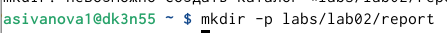

---
## Author
author:
  name: Иванова Анастасия Сергеевна
  degrees: DSc
  orcid: 0000-0002-0877-7063
  email: 1132250427@rudn.ru
  affiliation:
    - name: Российский университет дружбы народов
      country: Российская Федерация
      postal-code: 117198
      city: Москва
      address: ул. Миклухо-Маклая, д. 6

## Title
title: "Отчет по лабораторной работе"
license: "CC BY"
---

# Цель работы

Целью работы является изучение идеологии и применения средств контроля версий, приобретение практических навыков по работе с системой контроля версий git.

# Порядок выполнения лабораторной работы

2.1. Настройка github

Существует несколько доступных серверов репозиториев с возможностью бесплатного размещения данных. Например: http://bitbucket.org/, https://github.com/ и https://gitflic.ru. Для выполнения лабораторных работ предлагается использовать Github. Создайте учётную запись на сайте https://github.com/ и заполните основные данные ([рис. @fig-001]):

{#fig-001 width=70%}

2.2. Базовая настройка git

Сначала сделаем предварительную конфигурацию git. Откроем терминал и введем следующие команды, указав имя и e-mail владельца репозитория ([рис. @fig-002]):

{#fig-002 width=70%}

2.3. Создание SSH-ключа

Для последующей идентификации пользователя на сервере репозиториев  сгенерируем ключ (Рисунок 3.3):

Далее нам необходимо загрузить сгенерированный ключ. Для этого зайдем на сайт http://github.org/ под своей учётной записью и перейдем в меню Setting . После этого выберем в боковом меню SSH and GPG keys и нажмем кнопку New SSH key . Копируем из локальной консоли ключ в буфер обмена, и вставляем ключ в появившееся на сайте поле, и указываем для ключа имя (key) ([рис. @fig-003]):

{#fig-003 width=70%}

2.4. Создание рабочего пространства и репозитория курса

При выполнении лабораторных работ следует придерживаться структуры рабочего пространства. Откроем терминал и создадим каталог для предмета «Архитектура компьютера» ([рис. @fig-004]):

{#fig-004 width=70%}

2.5. Создание репозитория курса 

Репозиторий на основе шаблона можно создать через web-интерфейс github. 	
Перейдем на станицу репозитория с шаблоном курса https://github.com/yamadharma/cour se-directory-student-template и далее выберите Use this template ([рис. @fig-005]):

{#fig-005 width=70%}

В открывшемся окне зададим имя репозитория (Repository name) study_2025–2026_arh-pc и создадим репозиторий (кнопка Create repository from template) ([рис. @fig-007]):

{#fig-007 width=70%}

	
Ссылку для клонирования можно скопировать на странице созданного репозитория Code -> SSH ([рис. @fig-008]):

{#fig-008 width=70%}

Клонируем созданный репозиторий ([рис. @fig-009]):

{#fig-009 width=70%}

([рис. @fig-010]):

{#fig-010 width=70%}

2.6. Настройка каталога курса

Выполним следующие действия :

1) перейдем в каталог курса и создадим необходимые каталоги:

echo arch-pc > COURSE
make prepare

2) отправим файлы на сервер:

git add .
git commit -am 'feat(main): make course structure'
git push

([рис. @fig-011]):

{#fig-011 width=70%}

([рис. @fig-012]):

{#fig-012 width=70%}

Проверим правильность создания иерархии рабочего пространства в локальном репозитории и на странице github ([рис. @fig-013]):

{#fig-013 width=70%}

# Задания для самостоятельной работы

1. Создадим отчет по выполнению лабораторной работы в соответствующем каталоге рабочего пространства (labs/lab02/report) ([рис. @fig-014]):

{#fig-014 width=70%}

2. Скопируем отчеты по выполнению предыдущих лабораторных работ в соответствующие каталоги созданного рабочего пространства и загрузим файлы на github ([рис. @fig-015]):

{#fig-015 width=70%}

Сайт, в котором мы работали, выполняя лабораторную работу: https://github.com/

# Заключение

Мы изучили идеологию и применение средств контроля версий, а также приобрели практические навыки по работе с системой контроля версий git.

::: {#refs}
:::

